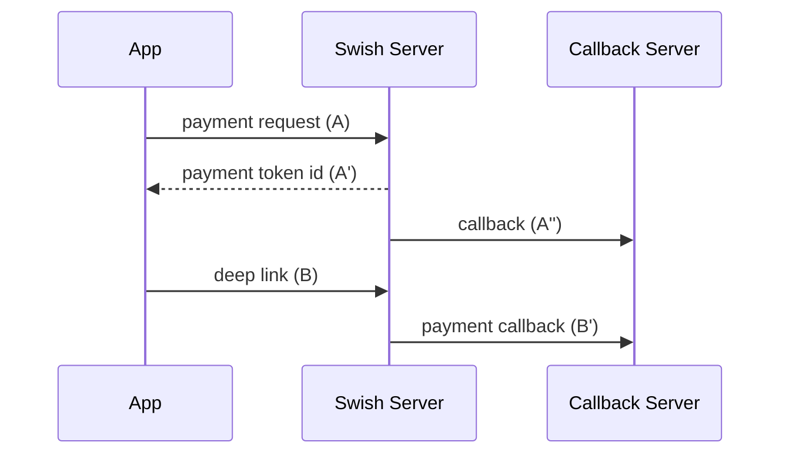

# Documentation about in-app Swish payment flow

Demo application for switsh payment flow under flutter


## Overall flow chart





## Details

### Step (A) create payment request
**URL** : `/swish-cpcapi/api/v1/paymentrequests`

**Method** : `POST`

**Auth required** : YES (client certificate)

**Payload (example)** :


```
{
    "payeePaymentReference": "0123456789", # Receiver of payment
    "callbackUrl": "https://example.com/api/paymentrequests", # must be https 
    "payeeAlias": "460100031456", # Receiver phone number country_code + number
    "amount": "100",
    "currency": "SEK", # only SEK for now  
    "message": "Kingston USB Flash Drive 8 GB" # Max 50 chars [a-öA-Ö0-9;:,.?!()]
}
```

### Step (A') success response 

***Code** : `200 OK`

***HEAD:***
```bash
PaymentRequestToken: f34DS34lfd0d03fdDselkfd3ffk21
```

### Step (A'') callback from Swish for payment request
***TODO*** : 

### Step (B) invoke Swish app with deep link

```javascript
// [deep link] 
swish://paymentrequest?token=$_paymentRequestToken&callbackurl=$callbackUrl
```

## Authors

* **Chengwei Ding**

## License

## Acknowledgments
